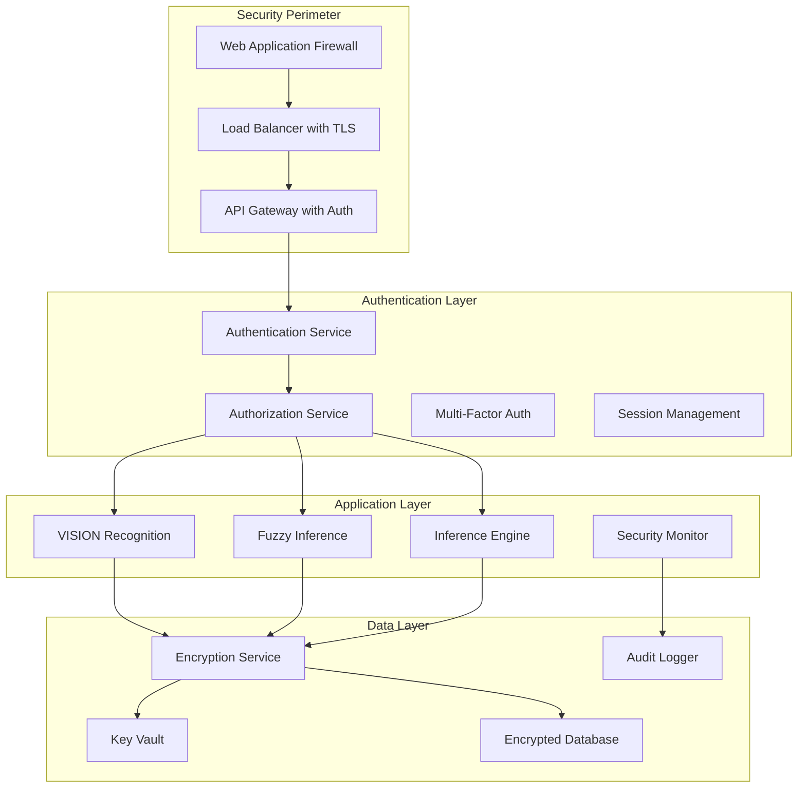
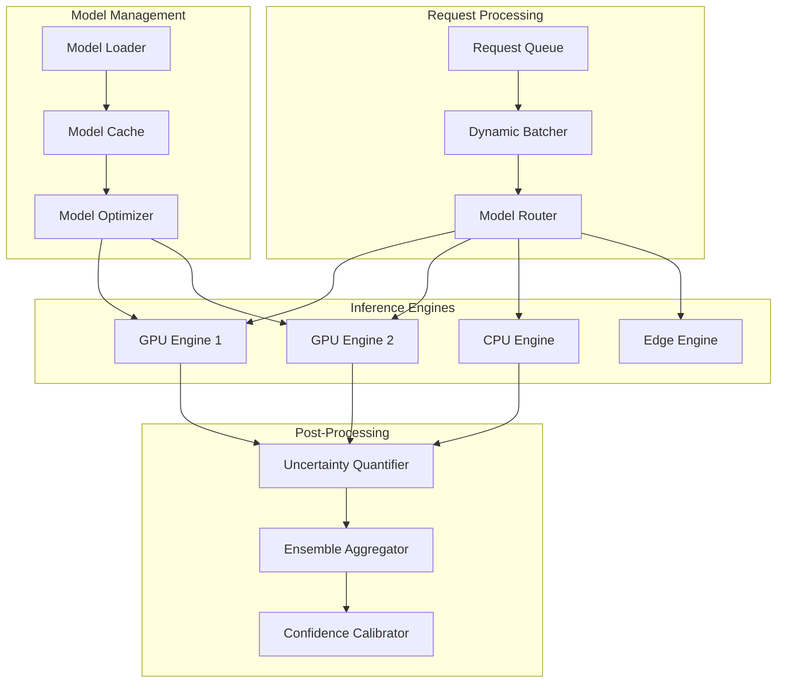

# Design Document

## Overview

This design implements a comprehensive security hardening and inference optimization solution for the UAV Wind-Turbine Inspection Suite. The solution addresses critical security vulnerabilities including command injection, path traversal, and insecure deserialization while implementing high-performance inference capabilities with GPU acceleration, distributed processing, and uncertainty quantification.

The architecture follows a defense-in-depth security model with multiple layers of protection, combined with a high-performance inference pipeline designed for enterprise-scale deployment. The system will transform from a vulnerable prototype into a production-ready platform suitable for critical infrastructure monitoring.

## Architecture

### Security Architecture



### Inference Architecture



## Components and Interfaces

### 1. Security Framework Components

#### SecurityManager
```python
class SecurityManager:
    def __init__(self):
        self.crypto_manager = CryptographicManager()
        self.auth_manager = AuthenticationManager()
        self.audit_logger = AuditLogger()
        self.input_validator = InputValidator()
    
    def validate_and_sanitize_input(self, input_data: Dict) -> Dict
    def authenticate_request(self, credentials: Dict) -> SecurityContext
    def authorize_operation(self, context: SecurityContext, operation: str) -> bool
    def log_security_event(self, event: SecurityEvent) -> None
```

#### InputValidator
```python
class InputValidator:
    def validate_file_path(self, path: str) -> str
    def validate_json_schema(self, data: Dict, schema: Dict) -> bool
    def sanitize_command_args(self, args: List[str]) -> List[str]
    def validate_numerical_bounds(self, value: float, min_val: float, max_val: float) -> bool
```

#### SecureSubprocessManager
```cpp
class SecureSubprocessManager {
public:
    struct ProcessConfig {
        std::vector<std::string> command;
        std::map<std::string, std::string> environment;
        std::string working_directory;
        int timeout_seconds;
        bool capture_output;
    };
    
    ProcessResult executeSecurely(const ProcessConfig& config);
    bool validateCommand(const std::vector<std::string>& command);
    std::string sanitizePath(const std::string& path);
};
```

### 2. Inference Engine Components

#### InferenceEngine
```python
class InferenceEngine:
    def __init__(self, config: InferenceConfig):
        self.model_manager = ModelManager()
        self.batch_processor = BatchProcessor()
        self.uncertainty_quantifier = UncertaintyQuantifier()
        self.performance_monitor = PerformanceMonitor()
    
    async def process_request(self, request: InferenceRequest) -> InferenceResult
    def load_model(self, model_name: str, model_path: str) -> bool
    def optimize_model(self, model_name: str, optimization_level: OptimizationLevel) -> bool
```

#### DistributedInferenceManager
```python
class DistributedInferenceManager:
    def __init__(self, cluster_config: ClusterConfig):
        self.node_manager = NodeManager()
        self.load_balancer = LoadBalancer()
        self.fault_tolerance = FaultToleranceManager()
    
    def distribute_workload(self, requests: List[InferenceRequest]) -> List[NodeAssignment]
    def handle_node_failure(self, node_id: str) -> None
    def rebalance_cluster(self) -> None
```

#### GPUAccelerationManager
```cpp
class GPUAccelerationManager {
private:
    std::vector<std::unique_ptr<GPUDevice>> gpu_devices_;
    std::unique_ptr<MemoryPool> memory_pool_;
    std::unique_ptr<StreamManager> stream_manager_;

public:
    bool initializeGPUs();
    GPUDevice* selectOptimalGPU(const InferenceRequest& request);
    void* allocateGPUMemory(size_t size, int device_id);
    void deallocateGPUMemory(void* ptr, int device_id);
    cudaStream_t getAvailableStream(int device_id);
};
```

### 3. Integration Components

#### SecureIntegrationBridge
```python
class SecureIntegrationBridge:
    def __init__(self, security_manager: SecurityManager):
        self.security = security_manager
        self.process_manager = SecureSubprocessManager()
        self.data_validator = DataValidator()
    
    def secure_python_cpp_call(self, context: SecurityContext, 
                              command: str, args: Dict) -> Dict
    def validate_integration_data(self, data: Dict) -> bool
    def encrypt_inter_process_data(self, data: Dict) -> bytes
```

## Data Models

### Security Models

```python
@dataclass
class SecurityContext:
    user_id: str
    username: str
    role: UserRole
    permissions: List[str]
    session_token: str
    ip_address: str
    expires_at: datetime
    mfa_verified: bool

@dataclass
class SecurityEvent:
    timestamp: datetime
    event_type: SecurityEventType
    user_id: str
    resource: str
    action: str
    result: str
    risk_score: float
    metadata: Dict[str, Any]

@dataclass
class EncryptedData:
    data_id: str
    encrypted_content: bytes
    encryption_algorithm: str
    key_id: str
    classification: SecurityLevel
    created_at: datetime
```

### Inference Models

```python
@dataclass
class InferenceRequest:
    request_id: str
    model_name: str
    input_data: Dict[str, np.ndarray]
    priority: int
    timeout_ms: int
    security_context: SecurityContext
    metadata: Dict[str, Any]

@dataclass
class InferenceResult:
    request_id: str
    model_name: str
    outputs: Dict[str, np.ndarray]
    confidence_scores: Dict[str, float]
    uncertainty_estimates: Dict[str, float]
    processing_time_ms: float
    memory_usage_mb: float
    device_utilization: float
    success: bool
    error_message: Optional[str]

@dataclass
class ModelMetadata:
    model_name: str
    model_version: str
    framework: InferenceBackend
    input_shapes: Dict[str, Tuple[int, ...]]
    output_shapes: Dict[str, Tuple[int, ...]]
    optimization_level: OptimizationLevel
    memory_requirements_mb: float
    performance_metrics: Dict[str, float]
```

## Error Handling

### Security Error Handling

1. **Input Validation Errors**
   - Log security event with high risk score
   - Return sanitized error message
   - Implement rate limiting for repeated violations
   - Alert security team for suspicious patterns

2. **Authentication/Authorization Failures**
   - Log failed attempt with user context
   - Implement progressive delays for repeated failures
   - Lock accounts after threshold violations
   - Generate security alerts for admin review

3. **Encryption/Decryption Errors**
   - Log cryptographic failures securely
   - Fail securely without exposing sensitive data
   - Rotate keys if compromise is suspected
   - Notify security team immediately

### Inference Error Handling

1. **Model Loading Errors**
   - Retry with exponential backoff
   - Fall back to alternative models
   - Log detailed error information
   - Alert operations team

2. **GPU Memory Errors**
   - Implement graceful degradation to CPU
   - Clear memory pools and retry
   - Adjust batch sizes dynamically
   - Monitor memory usage patterns

3. **Distributed Processing Errors**
   - Redistribute failed requests
   - Mark failed nodes as unavailable
   - Implement circuit breaker pattern
   - Maintain request traceability

## Testing Strategy

### Security Testing

1. **Penetration Testing**
   - Automated vulnerability scanning
   - Manual security assessment
   - Social engineering simulation
   - Network security testing

2. **Input Validation Testing**
   - Fuzzing with malformed inputs
   - Boundary value testing
   - Injection attack simulation
   - Path traversal testing

3. **Authentication Testing**
   - Brute force attack simulation
   - Session management testing
   - Multi-factor authentication testing
   - Authorization bypass testing

4. **Encryption Testing**
   - Key management testing
   - Cryptographic algorithm validation
   - Data integrity verification
   - Secure communication testing

### Performance Testing

1. **Load Testing**
   - Concurrent request handling
   - Throughput measurement
   - Resource utilization monitoring
   - Scalability assessment

2. **Stress Testing**
   - System breaking point identification
   - Memory leak detection
   - GPU memory exhaustion testing
   - Network bandwidth saturation

3. **Inference Accuracy Testing**
   - Model prediction validation
   - Uncertainty quantification accuracy
   - Ensemble consistency testing
   - Calibration effectiveness measurement

4. **Distributed System Testing**
   - Node failure simulation
   - Network partition testing
   - Load balancing effectiveness
   - Data consistency verification

### Integration Testing

1. **Security Integration**
   - End-to-end authentication flow
   - Cross-component authorization
   - Audit trail completeness
   - Secure data flow validation

2. **Performance Integration**
   - Multi-model inference pipeline
   - GPU-CPU workload distribution
   - Batch processing efficiency
   - Real-time processing capability

3. **System Integration**
   - VISION-Fuzzy integration security
   - C++-Python secure communication
   - Database encryption integration
   - Monitoring system integration

## Deployment Considerations

### Security Deployment

1. **Infrastructure Security**
   - Network segmentation
   - Firewall configuration
   - Intrusion detection systems
   - Security monitoring tools

2. **Application Security**
   - Secure configuration management
   - Environment variable protection
   - Certificate management
   - Security patch management

3. **Data Security**
   - Encryption key distribution
   - Secure backup procedures
   - Data retention policies
   - Compliance requirements

### Performance Deployment

1. **Hardware Requirements**
   - GPU specifications and drivers
   - Memory requirements
   - Network bandwidth needs
   - Storage performance requirements

2. **Software Dependencies**
   - CUDA/OpenCL runtime
   - Deep learning frameworks
   - Monitoring tools
   - Security libraries

3. **Scaling Configuration**
   - Auto-scaling policies
   - Load balancing rules
   - Resource allocation limits
   - Performance thresholds

## Monitoring and Alerting

### Security Monitoring

1. **Real-time Alerts**
   - Failed authentication attempts
   - Suspicious access patterns
   - Security policy violations
   - System intrusion attempts

2. **Compliance Monitoring**
   - Audit log completeness
   - Data access tracking
   - Encryption status verification
   - Security control effectiveness

### Performance Monitoring

1. **System Metrics**
   - CPU/GPU utilization
   - Memory usage patterns
   - Network throughput
   - Storage I/O performance

2. **Application Metrics**
   - Inference latency
   - Throughput rates
   - Error rates
   - Model accuracy metrics

3. **Business Metrics**
   - Inspection completion rates
   - System availability
   - User satisfaction scores
   - Cost per inference

This design provides a comprehensive foundation for implementing both security hardening and inference optimization while maintaining the existing functionality of the UAV inspection system.